# VAANI — 3-Member Team Implementation Plan & Project Status
**Open Innovation Hackathon | Restaurant & Cafe Challenge**  
*Project: Vaani — The Multilingual Voice Agent That Answers Every Call a Cafe Misses*  
*Document Version: 1.0 | Date: October 2026*

---

## 1. Executive Summary & Current Project Audit

### 1.1 Project Objective
VAANI is an agentic, voice-first operational system for independent cafes and restaurants. It answers incoming customer phone/web calls in **code-mixed Telugu, Hindi, and English**, takes takeaway orders, calculates live queue-aware prep times, writes tickets instantly to a Kitchen Display System (KDS), notifies the customer via SMS/WhatsApp, and dynamically replans open orders if an item runs out of stock mid-shift.

### 1.2 "No-Mocks" Hackathon Rule Compliance
Judges evaluate working software, not simulated slide decks:
1. **Real Calls**: Live phone number (Amazon Connect / Twilio / SIP) with fallback to in-browser Web Call (WebRTC/mic).
2. **Live Menu & Stock**: Real editable database with prices, availability, and spoken aliases.
3. **Real Kitchen Display**: Live tickets updating automatically as orders are placed.
4. **Real Customer Message**: Real SMS/WhatsApp notification delivered to the caller's phone.
5. **Real Agentic Behavior**: Live stock-out toggle stops future orders, replans affected open tickets, and alerts customers live during the demo.

---

### 1.3 Current Codebase Status Audit (Where We Stand Today)

| Component / Subsystem | Current State | Completeness | Key Gaps & Observations |
| :--- | :--- | :--- | :--- |
| **Frontend UI (Next.js 13 App Router)** | 🟢 Advanced Prototype | **75%** | Complete UI layout, Sidebar, Topbar, pages for Orders, Live Operations, Menu, Inventory, Calls, Analytics, Settings. Tailwind + Radix UI styled. |
| **Authentication & Tenant Security** | 🟡 Partial / In Progress | **40%** | AWS Cognito client configured (`lib/server-auth.ts`, `app/api/auth/route.ts`). UI has sign-in/sign-up forms. `.env.local` contains credentials. |
| **Database & Persistence** | 🟡 Schema Ready, Unwired | **35%** | PostgreSQL schema defined (`db/schema.sql`). Generic query route (`/api/data/route.ts`). However, `.env.local` has incomplete DB host; local/RDS instance not connected. |
| **Voice / Telephony Layer** | 🔴 Not Started | **0%** | No Amazon Connect contact flow, no Twilio/SIP trunk, no browser audio streaming / WebRTC click-to-call implemented. |
| **Speech Processing (ASR & TTS)** | 🔴 Not Started | **0%** | No integration with Amazon Transcribe, Polly, Deepgram, Whisper, or Sarvam AI for multilingual/code-mixed speech. |
| **LLM Dialogue Orchestrator** | 🔴 Not Started | **0%** | `/app/app/ai-receptionist` is currently a **static visual preview**. No LLM (Bedrock / Gemini / OpenAI) tool-calling agent implemented. |
| **Agentic Logic (Prep Engine & Replanner)** | 🔴 Not Started | **0%** | No dynamic queue calculation across kitchen stations (drinks, fryer, griddle). Stock-out toggle does not trigger order replanning or customer outreach. |
| **Customer Messaging (SMS/WhatsApp)** | 🔴 Not Started | **0%** | No SMS or WhatsApp provider connected (Twilio / AWS SNS / WhatsApp Cloud API). |

---

## 2. Team Structure & Ownership Matrix (3 Members)

To maximize velocity without merge conflicts or overlapping responsibilities, the workload is divided into three distinct, specialized roles matching the architecture defined in Section 10.3 of the implementation specification:

```
┌────────────────────────────────────────────────────────────────────────┐
│                                 VAANI                                  │
├─────────────────────┬──────────────────────────┬───────────────────────┤
│   MEMBER 1 (VOICE)  │    MEMBER 2 (BACKEND)    │   MEMBER 3 (PRODUCT)  │
│  Voice & Language   │  Backend & AI Agent      │  Frontend & Kitchen   │
├─────────────────────┼──────────────────────────┼───────────────────────┤
│ • Audio Streaming   │ • LLM Agent Orchestrator │ • Kitchen Display     │
│ • Web Call / Connect│ • Tool Execution Engine  │ • Menu & Stock UI     │
│ • Speech-to-Text    │ • Prep-Time ETA Engine   │ • Owner Summary Stats │
│ • Text-to-Speech    │ • Stock-Out Replanner    │ • SMS / WhatsApp Sent │
│ • Code-Mixed Vocab  │ • DB Transactions & API  │ • Demo Script & Pres. │
└─────────────────────┴──────────────────────────┴───────────────────────┘
```

---

## 3. Detailed Work Breakdown by Member

### 👤 MEMBER 1: Voice & Language Engineer
> **Mission**: Own the caller audio pipeline from the first "Namaste" to natural code-mixed speech understanding and response synthesis.

#### Core Responsibilities:
1. **Telephony & Web Audio Gateway**:
   - Primary: Set up Amazon Connect instance (or Twilio Voice) with an inbound contact flow.
   - Guaranteed Fallback: Build a clean **Web Call interface** (in-browser microphone audio streaming via WebSockets/MediaRecorder) on the website so judges can test instantly even if telephony provisioning delays occur.
2. **Multilingual Speech-to-Text (ASR)**:
   - Configure streaming ASR supporting Indian code-mixed speech (Telugu + Hindi + English, e.g., Amazon Transcribe Multilingual Streaming or Sarvam AI / Deepgram).
   - Anchor recognition using the cafe's phonetic aliases (e.g., "kaapi", "samosa", "spicy ga kakunda", "do plate", "rendu").
3. **Text-to-Speech (TTS) & Barge-in**:
   - Configure high-quality natural Indian English / Hindi voice synthesis (Amazon Polly neural voices like *Kajal*, *Aditi*, or ElevenLabs/Google Cloud TTS).
   - Implement barge-in handling (muting audio output when the caller interrupts).
4. **Voice Interaction Test Suite**:
   - Assemble a benchmark set of 30+ real audio/text utterances covering:
     - Pure English, Pure Hindi, Pure Telugu, and Code-Mixed combos.
     - Spoken corrections ("Actually make that two coffees, not one").
     - Quantity words ("rendu", "do", "teen", "five").
     - Out-of-stock items and allergen questions.

#### Member 1 Key Deliverables & Files:
- `lib/voice/audio-stream.ts` (Web audio capture & WebSocket streaming)
- `lib/voice/asr-provider.ts` (Speech-to-text wrapper with language hints)
- `lib/voice/tts-provider.ts` (Text-to-speech synthesis wrapper)
- `app/call/page.tsx` or `/components/voice-call-modal.tsx` (Click-to-call judge test interface)
- `tests/voice-utterances.json` (Benchmark test audio & transcripts)

---

### 👤 MEMBER 2: Backend & AI Agent Engineer
> **Mission**: Build the "brain" and data pipeline — LLM tool-calling orchestrator, queue-aware prep-time calculator, stock-out replanning engine, and transactional order persistence.

#### Core Responsibilities:
1. **LLM Dialogue Orchestrator & Tool Calling**:
   - Implement the dialogue agent (using AWS Bedrock Claude 3.5 Sonnet / Gemini 1.5 Flash / GPT-4o) with strict tool calling.
   - Strictly enforce: **The LLM never calculates prices, stock, or prep times itself.** All facts come from tool calls.
   - Core tools to implement:
     - `search_menu(query, language)`
     - `add_item(itemId, quantity, options)` / `modify_item` / `remove_item`
     - `check_availability(itemIds)`
     - `get_eta(draftOrder)`
     - `confirm_order(draftOrderId, callerConfirmation)`
     - `escalate(reason, callerPhone)`
2. **Queue-Aware Prep-Time Engine**:
   - Model kitchen load across stations (Drinks, Griddle/Tiffin, Fryer, Bakery).
   - Formula: `ETA = Current Station Backlog + Base Prep Time + Safety Buffer`.
   - Update prep times based on active tickets in `orders` table.
3. **Stock-Out Replanner & Self-Correction**:
   - When an item is marked unavailable in `menu_items`:
     1. Stop offering it on active and future calls.
     2. Scan open orders with status `received` containing this item.
     3. Suggest owner-configured substitutes and trigger customer alert.
4. **Database & API Integration**:
   - Ensure local PostgreSQL instance is running with `db/schema.sql` seeded with Agra cafe menu (Tea, Coffee, Samosa, Bun Maska, Dosa, Puffs, etc.).
   - Implement atomic order placement: `orders` + `order_items` in a single transaction.

#### Member 2 Key Deliverables & Files:
- `lib/agent/orchestrator.ts` (Prompt, session management, turn-by-turn dialogue)
- `lib/agent/tools.ts` (Tool definitions and execution handlers)
- `lib/agent/prep-time.ts` (Queue-aware station prep-time algorithm)
- `lib/agent/replanner.ts` (Stock-out event listener & order replanning logic)
- `app/api/agent/chat/route.ts` (API endpoint connecting audio transcript to agent)
- `db/seed-cafe.sql` (Seed data for menu, stations, and aliases)

---

### 👤 MEMBER 3: Product, Frontend & Kitchen Integration Engineer
> **Mission**: Build the real-time kitchen loop, real customer notifications, owner analytics, and craft the bulletproof 5-minute live demo experience.

#### Core Responsibilities:
1. **Live Kitchen Display System (KDS)**:
   - Enhance `/app/app/live-operations`:
     - Auto-refresh / SSE / WebSocket so when Member 2's agent writes a new order, it appears within 2 seconds without manual reload.
     - Sound chime / visual badge for incoming voice orders.
     - One-click status flow: `Received` ➔ `Preparing` ➔ `Ready` ➔ `Completed`.
     - Station-filtered views (e.g., Drinks Station vs. Food Station).
2. **Live Stock Toggle & Replanning UI**:
   - Enable staff to toggle item availability directly on the kitchen screen or `/app/app/menus`.
   - Show a visual banner when a stock-out occurs, showing which orders were auto-replanned and alerted.
3. **Real Customer Messaging Integration (SMS / WhatsApp)**:
   - Integrate Twilio SMS / AWS SNS / WhatsApp Business API.
   - Send instant SMS upon order confirmation:
     > *"Namaste! Your order #ORD-104 (1 Filter Coffee, 2 Veg Puffs) is confirmed at Cafe Vaani. Prep time: 12 mins. Total: ₹140."*
   - Send follow-up update if item runs out or order is ready for pickup.
4. **Owner Summary Dashboard & Live Demo Flow**:
   - Polish `/app/app/analytics` & `/app/app/page.tsx` with live metrics:
     - Total Calls Answered vs. Missed
     - Voice Orders Captured (₹ Gross Revenue)
     - Stock-Out Events Handled
     - Average Quoted Prep Time vs. Actual
   - Rehearse and coordinate the live 5-minute hackathon demo script.

#### Member 3 Key Deliverables & Files:
- `app/app/live-operations/page.tsx` (Real-time KDS with sound alerts and status transitions)
- `lib/notifications/sms.ts` (SMS/WhatsApp provider integration)
- `app/api/kitchen/stock-toggle/route.ts` (Stock toggle trigger)
- `app/app/analytics/page.tsx` (Owner operational summary with live DB figures)
- `DEMO_SCRIPT.md` (Step-by-step judge demonstration guide)

---

## 4. Phase-by-Phase Execution Roadmap (Sprints)

```mermaid
gantt
    title Vaani 3-Member Sprint Roadmap
    dateFormat  X
    axisFormat  Day %d
    
    section Member 1 (Voice)
    Web Audio Stream & STT           :active, m1_1, 0, 2
    Polly TTS & Code-Mix Testing     :m1_2, 2, 4
    Connect Telephony & Tuning       :m1_3, 4, 6

    section Member 2 (Backend/AI)
    DB Setup & Seed Data             :active, m2_1, 0, 1
    LLM Tools & Dialogue Agent       :m2_2, 1, 3
    Prep-Time Engine & Replanner     :m2_3, 3, 5

    section Member 3 (Frontend/Ops)
    Live KDS Realtime Sync           :active, m3_1, 0, 2
    SMS / WhatsApp Integration       :m3_2, 2, 4
    Owner Metrics & Demo Polish      :m3_3, 4, 6
```



### Phase 0: Foundations & Local Baseline (Day 1)
- **All**: Verify local PostgreSQL database running, execute `db/schema.sql`, and run seed data (`db/seed-cafe.sql`).
- **Member 1**: Build Web Audio recorder component to capture mic audio in chunks. Test AWS Transcribe or Deepgram/Sarvam streaming.
- **Member 2**: Implement basic LLM tool schemas (`search_menu`, `add_item`, `get_eta`, `confirm_order`) and test in isolated script.
- **Member 3**: Fix DB connection in `.env.local`, ensure `/app/live-operations` reads live PostgreSQL orders and updates status.

### Phase 1: Core Ordering Loop (Days 2–3)
- **Member 1**: Connect microphone audio stream to ASR and wire resulting transcript to Member 2's API.
- **Member 2**: Connect LLM to menu database. Complete `add_item`, price calculation, read-back prompt, and atomic write to `orders` table.
- **Member 3**: Wire order status changes in KDS. Set up SMS provider account (Twilio / AWS SNS) and send first test order confirmation SMS.
- *Milestone Checkpoint 1*: A user speaks into the web mic: "One filter coffee and two samosas", agent confirms, order appears on KDS screen, SMS arrives on phone.

### Phase 2: Agentic Layer & Kitchen Feedback Loop (Days 4–5)
- **Member 1**: Add TTS synthesis so the agent speaks back with natural Indian voice. Support interruptions/barge-in. Add Hindi/Telugu test utterances.
- **Member 2**: Build Station Queue Prep-Time algorithm. Build Stock-out event handler that catches menu toggles and updates draft/open orders.
- **Member 3**: Add stock-out toggle to KDS. Display auto-replanned order notifications on kitchen screen. Send update SMS on stock-out.
- *Milestone Checkpoint 2*: Live stock toggle test: Staff marks Samosa out of stock. Caller asks for Samosa; agent proactively says "Samosa is finished, would you like a Veg Puff instead?".

### Phase 3: Hardening & Rehearsal (Day 6)
- **Member 1**: Telephony test (Amazon Connect phone number or verified Web Call). Latency profiling (target < 2.0s response time).
- **Member 2**: Test edge cases: large order escalation, dietary/allergen safety handover, order corrections.
- **Member 3**: Polish Owner Summary analytics dashboard. Finalize 5-minute presentation deck & live demo backup recordings.
- *Milestone Checkpoint 3*: Complete end-to-end rehearsal 3 times consecutively without manual intervention.

---

## 5. Shared Interface Contracts & Integration Points

To prevent merge friction, team members agree to these three stable schemas:

### Contract A: Voice-to-Agent Event (Member 1 ➔ Member 2)
```typescript
interface VoiceTranscriptEvent {
  callId: string;
  callerPhone: string;
  transcript: string;
  isFinal: boolean;
  languageDetected?: 'en' | 'hi' | 'te';
}
```

### Contract B: Order Created Event (Member 2 ➔ Member 3)
```typescript
interface OrderCreatedPayload {
  orderId: string;
  orderNumber: string;
  customerPhone: string;
  items: Array<{ name: string; quantity: number; price: number; station: string }>;
  totalAmount: number;
  prepEtaMinutes: number;
  status: 'received';
  channel: 'voice' | 'phone';
}
```

### Contract C: Stock-Out Event (Member 3 ➔ Member 2)
```typescript
interface StockOutEvent {
  propertyId: string;
  menuItemId: string;
  itemName: string;
  available: boolean;
  substituteItemId?: string;
}
```

---

## 6. Winning 5-Minute Live Demo Script

| Time | Action | Visual on Screen | What the Judges Experience | Owner |
| :---: | :--- | :--- | :--- | :---: |
| **0:00 - 0:45** | **The Hook**: Explain the missed-call leak in Indian cafes & code-mixed reality. | Slides / Problem statement | No keypad IVR, no English-only bot. | Member 3 |
| **0:45 - 2:00** | **Live Call 1**: Judge calls the number (or clicks Web Call). Orders in Hindi/Telugu mix: *"Oka filter coffee, do samosa, spicy ga kakunda"*. | Live KDS screen displayed on projector | Ticket `#ORD-101` appears on KDS in **real time** with ETA of 12 mins. Caller gets real SMS. | Member 1 & 2 |
| **2:00 - 3:15** | **Agentic Stock-Out**: Kitchen staff toggles Samosa to "Out of Stock". | KDS stock toggle switch | Live stock alert triggers. Open orders replanned. | Member 3 |
| **3:15 - 4:15** | **Live Call 2**: Second call placed: *"Two samosas please"*. Agent replies: *"Samosa finished today. Can I offer you hot veg puffs?"* | Agent audio waveform + live transcript | Demonstrates real dynamic kitchen awareness without code changes. | Member 1 & 2 |
| **4:15 - 5:00** | **Owner Summary**: Open owner dashboard. | `/app/app/analytics` | Shows revenue saved, call logs, stock-out history. Q&A. | Member 3 |

---

## 7. Immediate Next Steps for the Team (Day 1 Action Items)

1. **Member 1**:
   - [ ] Set up audio input capture component (`components/voice-call-modal.tsx`).
   - [ ] Connect streaming STT test with sample Telugu/Hindi audio files.
2. **Member 2**:
   - [ ] Start local PostgreSQL and run `db/schema.sql`.
   - [ ] Write `db/seed-cafe.sql` with cafe menu and phonetic aliases.
   - [ ] Create `/lib/agent/orchestrator.ts` with Bedrock/Gemini/OpenAI tool calling.
3. **Member 3**:
   - [ ] Test real-time polling/refresh on `/app/app/live-operations`.
   - [ ] Obtain Twilio / AWS SNS test credentials for order SMS delivery.
   - [ ] Create demo script draft and presentation deck template.
